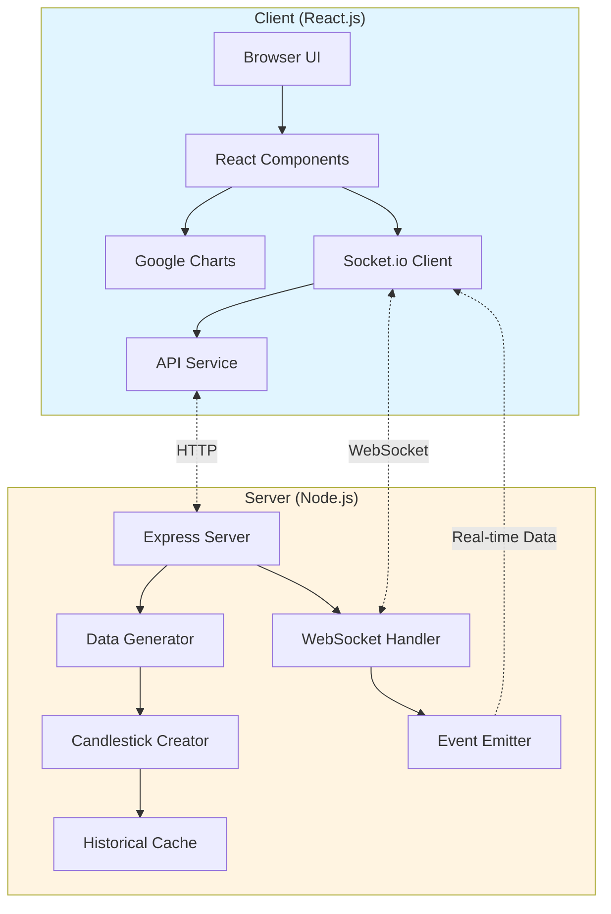
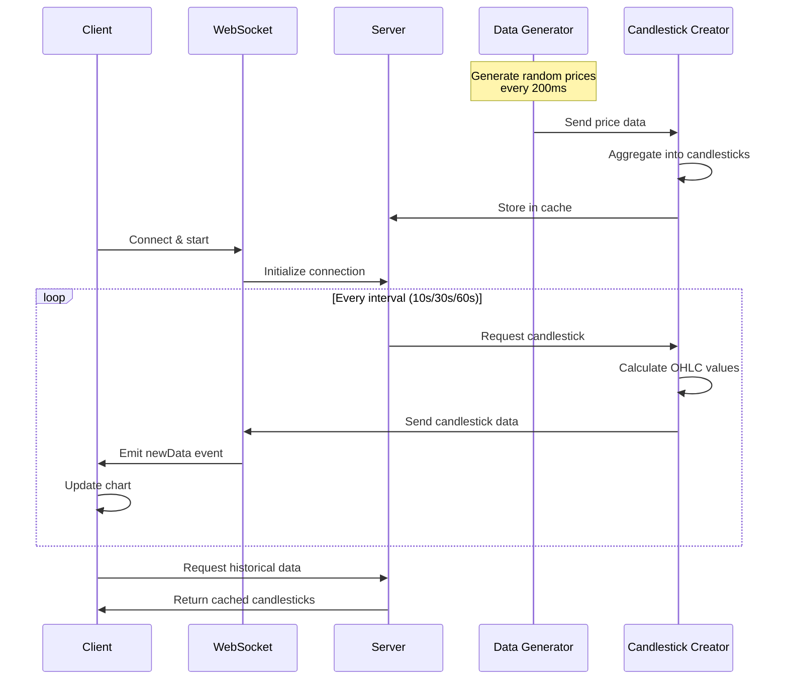

# Candlesticks

A real-time financial charting application that generates and displays candlestick price charts with configurable intervals. Built with React.js and Node.js using WebSocket technology for live data streaming.

Built in December 2018. This full-stack JavaScript application simulates market data generation, processes it into candlestick format, and visualizes it in real-time using Google Charts.

## Features

### Core Capabilities

- **Real-time Data Streaming**: Live price updates via WebSockets.
- **Dynamic Aggregation**: Automatic OHLC calculation (Open, High, Low, Close).
- **Historical Data**: retrieval and server-side caching of past candlesticks.
- **Multi-Interval Support**: Toggle between 10s, 30s, and 60s intervals.

### Technical Excellence

- **Full-Stack JavaScript**: Unified language for both frontend and backend.
- **WebSocket Integration**: Low-latency communication with Socket.io.
- **Responsive UI**: Modern React.js frontend for seamless user experience.
- **Scalable Backend**: Node.js and Express architecture.

### Developer Experience

- **Hot-Reloading**: Instant feedback during development with React.
- **Integrated Linting**: Pre-configured ESLint for code quality.
- **Simple Setup**: Get up and running in minutes with clear instructions.
- **Modular Codebase**: Well-organized directory structure for easy navigation.

## Architecture Overview



### Architecture Principles

- **Separation of Concerns**: Clear distinction between data generation (server) and data visualization (client).
- **Event-Driven**: Real-time updates driven by WebSocket events.
- **Stateless Visualization**: The client remains thin, relying on the server for data processing and aggregation.
- **Scalability**: Backend designed to handle multiple concurrent WebSocket connections.

### Design Patterns

- **Observer Pattern**: Used for WebSocket communication where clients subscribe to data updates.
- **Singleton Pattern**: Ensures single instances of data generation and caching services on the server.
- **Container/Component Pattern**: React architecture separating logic-heavy containers from presentational components.
- **Middleware Pattern**: Express middleware for logging and error handling.

## Data Flow



## Getting Started

### Prerequisites

- Node.js (v10 or higher)
- npm or yarn
- Modern web browser

### Installation

1. Clone the repository:

```bash
git clone https://github.com/orassayag/candlesticks.git
cd candlesticks
```

2. Install server dependencies:

```bash
cd candlesticks/server
npm install
```

3. Install client dependencies:

```bash
cd ../client
npm install
```

### Running the Application

1. **Start the server** (in one terminal):

```bash
cd candlesticks/server
npm start
```

You should see: `Listening to express server port 3000...`

2. **Start the client** (in another terminal):

```bash
cd candlesticks/client
npm start
```

Browser will automatically open at `http://localhost:3001`

3. **Wait 10 seconds** for initial data collection before the first candlestick appears

4. **Happy testing!** 🎉

## Usage

1. **Launch the Application**: Start both the server and client as described in the Installation section.
2. **View Live Data**: Once the client loads, wait 10 seconds for the first candlestick to be generated and displayed.
3. **Change Intervals**: Use the interval selector to switch between 10s, 30s, and 60s views.
4. **Analyze History**: The chart will automatically populate with historical data when switching intervals or on initial load.

## Configuration

### Server Settings

Edit `candlesticks/server/config/config.js`:

```javascript
{
  port: 3000,                    // Server port
  intervalCreateDataRate: 200,   // Data generation rate (ms)
  maxRandomNumber: 1000000,      // Max price value
  defaultEventRate: 100,         // Price points per interval
  cacheExpirationSeconds: 3600,  // Cache duration (1 hour)
  intervalRates: [10, 30, 60],   // Available intervals (seconds)
  maxCandlesticksCountEmit: 20   // Max historical candlesticks
}
```

### Client Settings

Edit `candlesticks/client/src/settings/settings.js`:

```javascript
{
  api_base_url: 'http://localhost:3000/';
}
```

## Available Scripts

### Server

```bash
npm start        # Start the server
npm run lint     # Check code quality
```

### Client

```bash
npm start        # Start development server with hot-reload
npm run build    # Create production build
npm test         # Run tests
npm run lint     # Check code quality
```

## Project Structure

```
candlesticks/
├── client/                    # React.js frontend
│   ├── src/
│   │   ├── api/              # API communication layer
│   │   ├── components/       # React components
│   │   ├── containers/       # Container components
│   │   ├── hoc/              # Higher-Order Components
│   │   ├── settings/         # Configuration
│   │   └── utils/            # Utility functions
│   ├── config/               # Webpack configuration
│   └── package.json
│
├── server/                    # Node.js backend
│   ├── config/               # Configuration files
│   ├── data/                 # Data storage
│   ├── middleware/           # Express middleware
│   ├── services/             # Business logic
│   ├── startup/              # Application initialization
│   │   ├── dataHandler.js   # Data generation & processing
│   │   ├── websocket.js     # WebSocket management
│   │   ├── routes.js        # API routes
│   │   └── logging.js       # Winston logger
│   ├── utils/                # Utility functions
│   ├── index.js              # Entry point
│   └── package.json
│
└── README.md
```

## Directory Structure

```text
candlesticks/
├── client/                 # React frontend application
│   ├── config/             # Build and environment configuration
│   ├── public/             # Static assets and index.html
│   ├── scripts/            # Build and test scripts
│   └── src/                # Frontend source code
│       ├── api/            # API client and routes
│       ├── components/     # Reusable UI components
│       ├── containers/     # Page-level components
│       ├── hoc/            # Higher-order components
│       ├── settings/       # Frontend configuration
│       └── utils/          # Frontend utility functions
├── server/                 # Node.js backend application
│   ├── config/             # Backend configuration
│   ├── data/               # Historical data storage
│   ├── middleware/         # Express middleware
│   ├── services/           # Backend services
│   ├── startup/            # Initialization logic
│   └── utils/              # Backend utility functions
└── misc/                   # Miscellaneous documentation and tasks
```

## How It Works

### Data Generation

1. Server generates 100 random price points every 200ms
2. Each batch contains: open (first), close (last), high (max), low (min)
3. Data is temporarily stored and aggregated into candlesticks

### Candlestick Creation

1. Price points are collected over the selected interval (10s, 30s, or 60s)
2. Server calculates:
   - **Open**: First price in the period
   - **Close**: Last price in the period
   - **High**: Highest price in the period
   - **Low**: Lowest price in the period
3. Candlestick is emitted to connected clients via WebSocket

### Real-Time Streaming

1. Client connects to server via Socket.io
2. Server emits new candlestick data at configured intervals
3. React component receives data and updates Google Charts visualization
4. Chart automatically refreshes without page reload

### Interval Switching

1. After 30 seconds, interval selection becomes available
2. Client sends new interval to server via API
3. Server recalculates candlesticks from historical data
4. New candlesticks are sent to client and chart updates

## API Reference

### WebSocket Events

#### Client → Server

- `start`: Initialize data streaming

#### Server → Client

- `connection`: Connection established
- `disconnect`: Connection closed
- `newData`: New candlestick data
  ```javascript
  {
    intervalStartCreateTimestamp: 1640000000,
    newCandlestick: {
      timestamp: 1640000010,
      open: 500000,
      close: 510000,
      high: 520000,
      low: 490000
    }
  }
  ```

### REST API

#### GET `/api/candlesticks`

Retrieves historical candlestick data.

**Query Parameters:**

- `interval`: Candlestick interval in seconds (10, 30, or 60)

**Response:**

```javascript
{
  candlesticks: [
    {
      timestamp: number,
      open: number,
      close: number,
      high: number,
      low: number,
    },
  ];
}
```

#### POST `/api/interval`

Updates the candlestick interval.

**Body:**

```javascript
{
  interval: 10 | 30 | 60;
}
```

## Technologies Used

### Frontend

- [React.js](https://reactjs.org) - UI framework
- [Socket.io Client](https://socket.io) - WebSocket client
- [Google Charts](https://developers.google.com/chart) - Chart visualization
- [Axios](https://axios-http.com) - HTTP client
- [Webpack](https://webpack.js.org) - Module bundler

### Backend

- [Node.js](https://nodejs.org) - JavaScript runtime
- [Express.js](https://expressjs.com) - Web framework
- [Socket.io](https://socket.io) - WebSocket server
- [Winston](https://github.com/winstonjs/winston) - Logging
- [Moment.js](https://momentjs.com) - Date/time handling
- [node-cache](https://github.com/node-cache/node-cache) - In-memory caching

### Development Tools

- [ESLint](https://eslint.org) - Code linting
- [Babel](https://babeljs.io) - JavaScript compiler

## Contributing

Contributions to this project are [released](https://help.github.com/articles/github-terms-of-service/#6-contributions-under-repository-license) to the public under the [project's open source license](LICENSE).

Everyone is welcome to contribute. Contributing doesn't just mean submitting pull requests—there are many different ways to get involved, including answering questions, reporting issues, improving documentation, or suggesting new features.

See [CONTRIBUTING.md](CONTRIBUTING.md) for detailed guidelines.

## Best Practices

- **Code Quality**: Ensure all code passes linting before submission.
- **Component Reusability**: Build modular React components for better maintainability.
- **Error Handling**: Implement robust error handling on both client and server.
- **Documentation**: Keep comments and documentation up to date with code changes.

## Support

For questions, issues, or contributions:

- **GitHub Issues**: [https://github.com/orassayag/candlesticks/issues](https://github.com/orassayag/candlesticks/issues)
- **Email**: orassayag@gmail.com

## Author

- **Or Assayag** - _Initial work_ - [orassayag](https://github.com/orassayag)
- Or Assayag <orassayag@gmail.com>
- GitHub: https://github.com/orassayag
- StackOverflow: https://stackoverflow.com/users/4442606/or-assayag?tab=profile
- LinkedIn: https://linkedin.com/in/orassayag

## License

This application has an MIT license - see the [LICENSE](LICENSE) file for details.

## Acknowledgments

- Built for educational and research purposes
- Respects robots.txt and implements rate limiting
- Uses user-agent rotation to avoid detection
- Implements polite crawling practices
