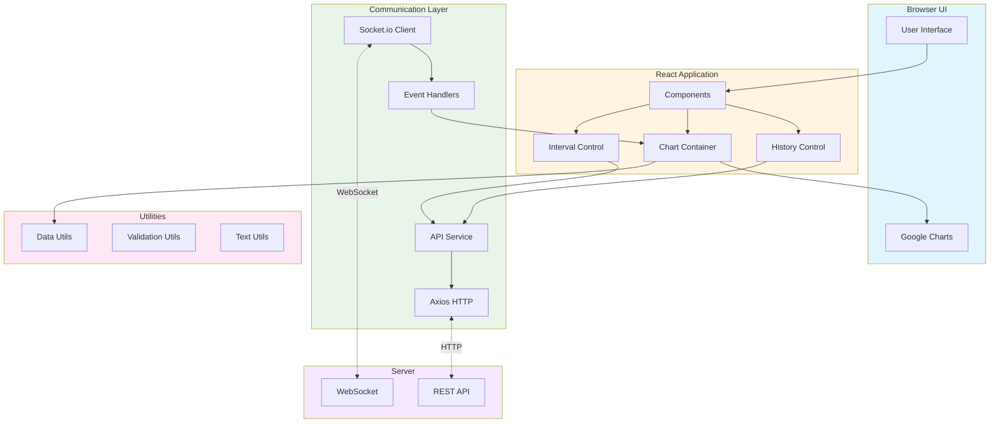
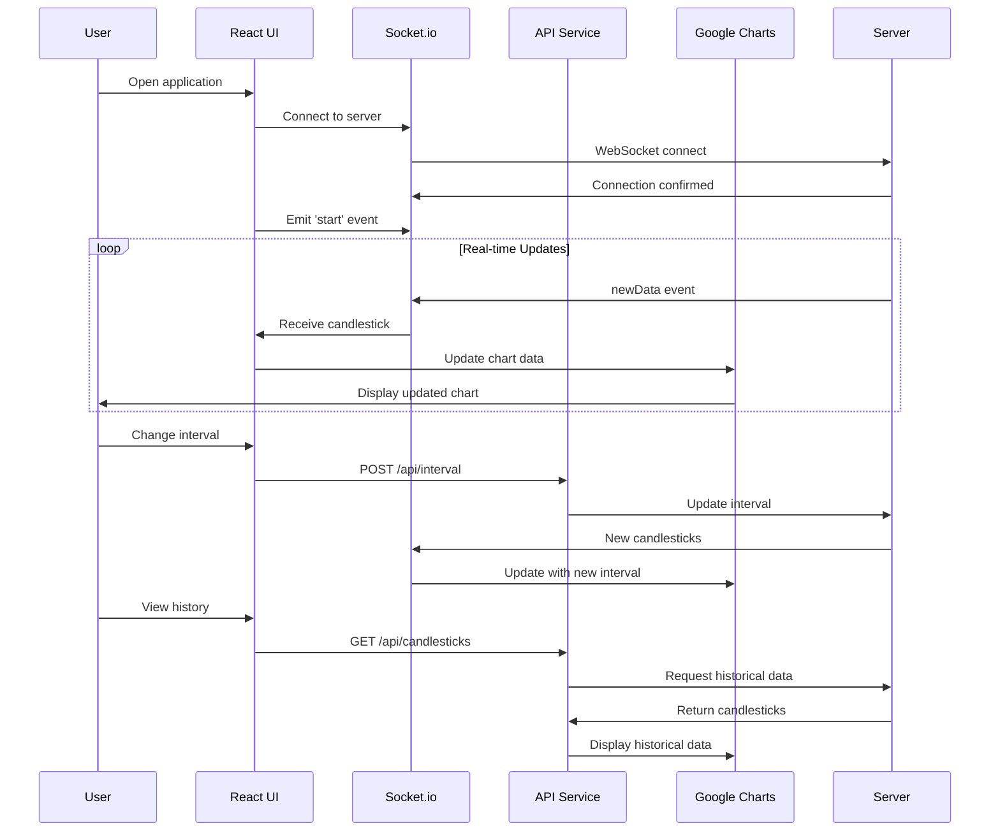

# Candlesticks Client

Real-time candlestick chart visualization using React.js, WebSocket, and Google Charts for live financial data display.

## Overview

The client component provides a responsive web interface for visualizing real-time candlestick charts. It connects to the server via WebSocket to receive live data updates and renders them using Google Charts with configurable intervals.

## Architecture



## Data Flow



## Features

- Real-time candlestick chart visualization
- WebSocket connection for live data streaming
- Configurable intervals (10s, 30s, 60s)
- Historical candlestick data viewing
- Responsive design
- Automatic reconnection handling
- Loading states and error handling
- Dynamic chart updates without page refresh

## Installation

```bash
cd candlesticks/client
npm install
```

## Usage

### Development Mode

Start the development server with hot-reload:

```bash
npm start
```

The application will open at `http://localhost:3001`

### Production Build

Create an optimized production build:

```bash
npm run build
```

The build files will be in the `build/` folder.

## Configuration

Edit `src/settings/settings.js`:

```javascript
const settings = {
  api_base_url: 'http://localhost:3000/', // Server URL
};

export default settings;
```

## Project Structure

```
client/
├── public/                    # Static assets
│   ├── index.html
│   └── favicon.ico
├── src/
│   ├── api/                   # API communication
│   │   ├── api.js            # Axios configuration
│   │   └── routes/
│   │       └── candlestick.js # Candlestick API routes
│   ├── components/            # React components
│   │   └── UI/               # UI components
│   │       └── index.js      # Component exports
│   ├── containers/            # Container components
│   │   └── index.js          # Container exports
│   ├── hoc/                   # Higher-Order Components
│   │   └── index.js          # HOC exports
│   ├── settings/              # Configuration
│   │   └── settings.js       # App settings
│   ├── utils/                 # Utility functions
│   │   ├── coreUtils.js      # Core utilities
│   │   ├── dataUtils.js      # Data processing
│   │   ├── textUtils.js      # Text formatting
│   │   └── validationUtils.js # Validation
│   ├── index.js               # Entry point
│   ├── App.js                 # Root component
│   └── registerServiceWorker.js
├── config/                    # Webpack configuration
│   ├── webpack.config.dev.js
│   ├── webpack.config.prod.js
│   └── webpackDevServer.config.js
├── scripts/                   # Build scripts
│   ├── start.js              # Development server
│   ├── build.js              # Production build
│   └── test.js               # Test runner
└── package.json
```

## Technologies

- **React.js**: UI framework (v16.5.2)
- **Socket.io Client**: WebSocket communication
- **Google Charts**: Chart visualization (react-google-charts)
- **Axios**: HTTP client for REST API calls
- **React Router**: Navigation
- **Webpack**: Module bundling
- **Babel**: JavaScript transpilation
- **ESLint**: Code linting

## Scripts

```bash
npm start       # Start development server
npm run build   # Create production build
npm test        # Run tests
npm run lint    # Run ESLint (if configured)
```

## Key Components

### Chart Container

Renders the candlestick chart using Google Charts:

```javascript
import { Chart } from 'react-google-charts';

<Chart
  chartType='CandlestickChart'
  data={chartData}
  options={chartOptions}
  width='100%'
  height='400px'
/>;
```

### WebSocket Connection

Manages Socket.io connection:

```javascript
import io from 'socket.io-client';
import settings from './settings/settings';

const socket = io(settings.api_base_url);

socket.on('connection', (connected) => {
  console.log('Connected:', connected);
});

socket.on('newData', (data) => {
  // Update chart with new candlestick
  updateChart(data.newCandlestick);
});

socket.emit('start');
```

### API Service

Handles REST API calls:

```javascript
import api from '../api/api';

// Get historical data
const response = await api.get('/candlesticks', {
  params: { interval: 30 },
});

// Update interval
await api.post('/interval', { interval: 30 });
```

## Chart Configuration

### Candlestick Data Format

Google Charts expects data in this format:

```javascript
[
  ['Time', 'Low', 'Open', 'Close', 'High'],
  ['10:00', 490000, 500000, 510000, 520000],
  ['10:10', 495000, 510000, 505000, 525000],
  // ...
];
```

### Chart Options

```javascript
const options = {
  legend: 'none',
  candlestick: {
    fallingColor: { strokeWidth: 0, fill: '#a52714' },
    risingColor: { strokeWidth: 0, fill: '#0f9d58' },
  },
  hAxis: {
    title: 'Time',
  },
  vAxis: {
    title: 'Price',
  },
};
```

## State Management

The application uses React component state and lifecycle methods:

```javascript
class CandlestickChart extends Component {
  state = {
    candlesticks: [],
    interval: 10,
    loading: true,
    connected: false,
  };

  componentDidMount() {
    this.connectWebSocket();
  }

  componentWillUnmount() {
    this.socket.disconnect();
  }

  // ... methods
}
```

## Error Handling

Handles connection errors and data errors:

```javascript
socket.on('connect_error', (error) => {
  console.error('Connection error:', error);
  // Show error message to user
});

socket.on('error', (error) => {
  console.error('Socket error:', error);
  // Handle error gracefully
});
```

## Browser Support

Configured to support:

- Modern browsers (Chrome, Firefox, Safari, Edge)
- > 0.2% market share
- Excludes IE 11 and below
- Excludes Opera Mini

## Development

### Hot Module Replacement

The development server supports hot-reloading:

- Changes to components automatically refresh
- State is preserved when possible
- Console shows build errors

### Debugging

Use React Developer Tools:

```bash
# Install Chrome extension
# React Developer Tools
```

Enable source maps in webpack config for debugging.

## License

MIT License - see [LICENSE](../LICENSE) file for details.

## Author

- **Or Assayag** - [orassayag](https://github.com/orassayag)
- Or Assayag <orassayag@gmail.com>
- GitHub: https://github.com/orassayag
- StackOverflow: https://stackoverflow.com/users/4442606/or-assayag?tab=profile
- LinkedIn: https://linkedin.com/in/orassayag
