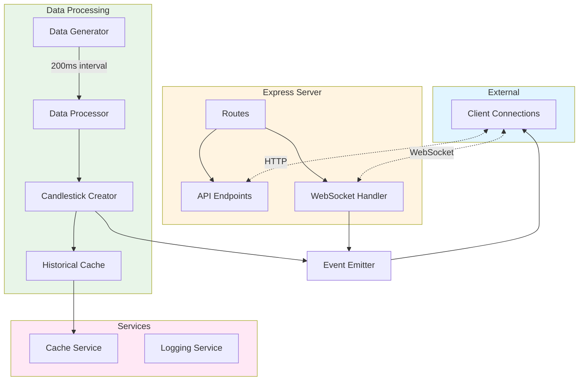
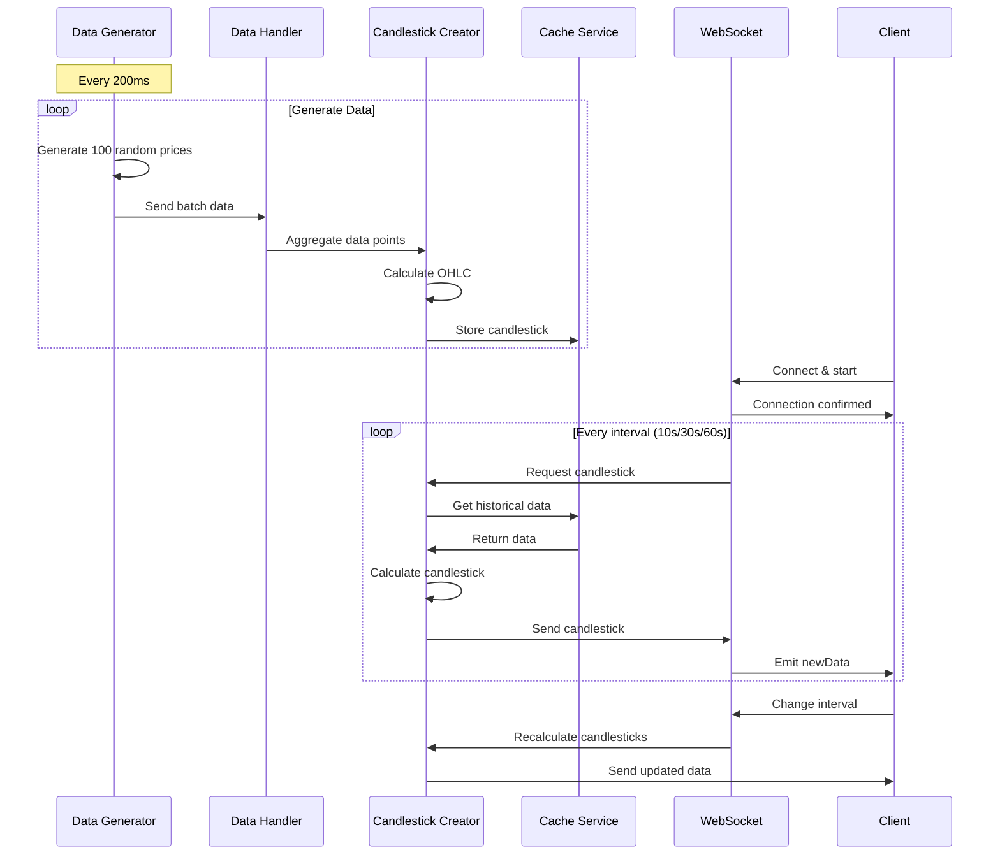

# Candlesticks Server

Real-time candlestick chart server using Node.js, Express, and WebSocket for live financial data streaming.

## Overview

The server component handles data generation, candlestick aggregation, WebSocket communication, and historical data caching. It generates random market data every 200ms, aggregates it into candlestick format based on configurable intervals, and streams it to connected clients in real-time.

## Architecture



## Data Flow



## Features

- Random market data generation at 200ms intervals
- Candlestick aggregation (Open, High, Low, Close)
- Real-time WebSocket streaming using Socket.io
- Configurable candlestick intervals (10s, 30s, 60s)
- Historical data caching with node-cache
- RESTful API for data retrieval
- Winston-based logging
- CORS-enabled for cross-origin requests

## Installation

```bash
cd candlesticks/server
npm install
```

## Usage

Start the server:

```bash
npm start
# or
node index.js
```

The server will start on port 3000 by default.

## Configuration

Edit `config/config.js`:

```javascript
{
  port: 3000,                    // Server port
  intervalCreateDataRate: 200,   // Data generation rate (ms)
  maxRandomNumber: 1000000,      // Maximum price value
  defaultEventRate: 100,         // Price points per interval
  cacheExpirationSeconds: 3600,  // Cache duration (1 hour)
  intervalRates: [10, 30, 60],   // Available intervals (seconds)
  maxCandlesticksCountEmit: 20   // Max historical candlesticks to return
}
```

## API Endpoints

### GET `/api/candlesticks`

Retrieves historical candlestick data.

**Query Parameters:**

- `interval` (number): Candlestick interval in seconds (10, 30, or 60)

**Response:**

```javascript
{
  candlesticks: [
    {
      timestamp: 1640000000,
      open: 500000,
      close: 510000,
      high: 520000,
      low: 490000,
    },
  ];
}
```

### POST `/api/interval`

Updates the candlestick interval for real-time streaming.

**Body:**

```javascript
{
  interval: 10 | 30 | 60; // seconds
}
```

**Response:**

```javascript
{
  success: true;
}
```

## WebSocket Events

### Server → Client

#### `connection`

Emitted when a client successfully connects.

```javascript
socket.on('connection', (connected) => {
  console.log('Connected:', connected); // true
});
```

#### `disconnect`

Emitted when a client disconnects.

```javascript
socket.on('disconnect', (disconnected) => {
  console.log('Disconnected:', disconnected); // true
});
```

#### `newData`

Emitted at the configured interval with new candlestick data.

```javascript
socket.on('newData', (data) => {
  console.log(data);
  // {
  //   intervalStartCreateTimestamp: 1640000000,
  //   newCandlestick: {
  //     timestamp: 1640000010,
  //     open: 500000,
  //     close: 510000,
  //     high: 520000,
  //     low: 490000
  //   }
  // }
});
```

### Client → Server

#### `start`

Client emits this to begin receiving real-time data.

```javascript
socket.emit('start');
```

## Project Structure

```
server/
├── config/
│   └── config.js              # Server configuration
├── data/
│   └── historicalData.js      # Historical data initialization
├── middleware/
│   └── error.js               # Error handling middleware
├── services/
│   └── CacheService.js        # Cache management
├── startup/
│   ├── dataHandler.js         # Data generation and aggregation
│   ├── general.js             # General middleware setup
│   ├── logging.js             # Winston logger configuration
│   ├── routes.js              # API route definitions
│   └── websocket.js           # WebSocket initialization
├── utils/
│   ├── dataUtils.js           # Data processing utilities
│   ├── textUtils.js           # Text formatting utilities
│   └── validateUtils.js       # Validation utilities
├── index.js                   # Entry point
└── package.json
```

## Technologies

- **Node.js**: JavaScript runtime
- **Express.js**: Web framework
- **Socket.io**: WebSocket library
- **Winston**: Logging
- **node-cache**: In-memory caching
- **Moment.js**: Date/time handling
- **CORS**: Cross-origin resource sharing
- **body-parser**: Request body parsing

## Scripts

```bash
npm start       # Start the server
npm run lint    # Run ESLint
```

## Environment Variables

```bash
NODE_ENV=development   # Environment (development/production)
PORT=3000             # Server port (optional, defaults to 3000)
```

## Development

### Logging

The server uses Winston for structured logging:

```javascript
const winston = require('winston');
winston.info('Server started');
winston.error('Error occurred', error);
```

### Adding New Intervals

To add new candlestick intervals:

1. Update `config.js`:

```javascript
intervalRates: [10, 30, 60, 120]; // Add 120 seconds
```

2. The system automatically handles the new interval

### Caching

Historical candlesticks are cached using node-cache:

```javascript
const cache = app.get('historicalData');
const candlesticks = cache.get('candlesticks');
```

Cache expires after 1 hour (configurable in `config.js`).

## License

MIT License - see [LICENSE](../LICENSE) file for details.

## Author

- **Or Assayag** - [orassayag](https://github.com/orassayag)
- Or Assayag <orassayag@gmail.com>
- GitHub: https://github.com/orassayag
- StackOverflow: https://stackoverflow.com/users/4442606/or-assayag?tab=profile
- LinkedIn: https://linkedin.com/in/orassayag
